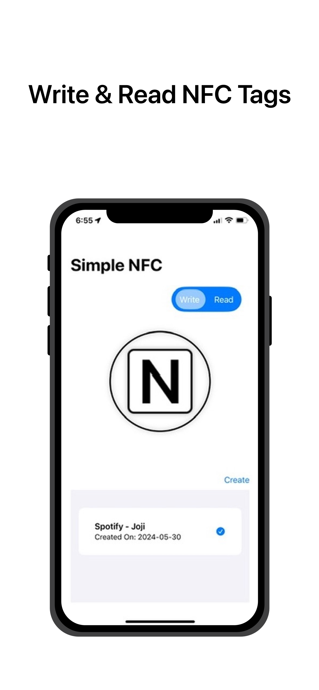
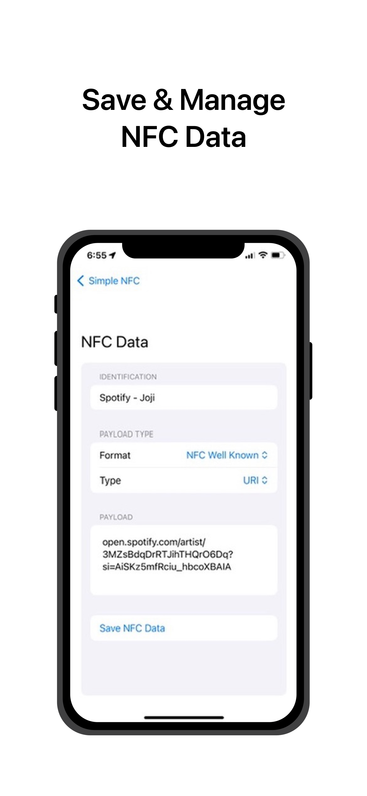
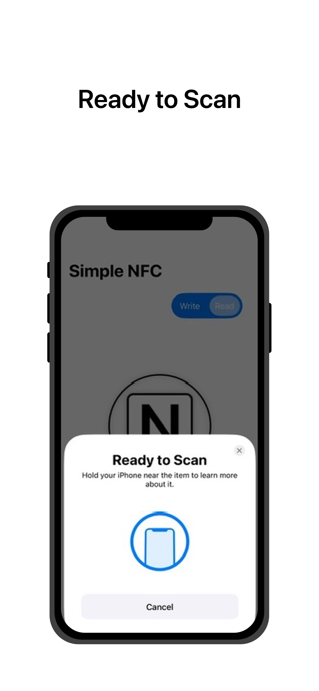

# Simple NFC Utilities

## Overview

**Simple NFC Utilities** is an iOS application built with SwiftUI, designed to provide a streamlined and efficient way to read and write NFC tags. This open-source project focuses on simplicity and ease of use, eliminating unnecessary bloatware to deliver a clean user experience.

[Blog explaining the development process](https://zthh.dev/blogs/simplenfc-corenfc-coredata-guide)
[Project page explaining goals](https://zthh.dev/projects/simple-nfc-utilities)

## Features

- **Read NFC Tags:** Quickly scan and retrieve information from NFC tags.
- **Write NFC Tags:** Easily encode data onto NFC tags with just a few taps.
- **User-Friendly Interface:** A clean and intuitive design for seamless interaction.
- **Efficient Performance:** Fast and reliable NFC operations without any hassle.

## Screenshots


_Write & Read NFC Tags_


_Save & Manage NFC Data_


_Ready to Scan_

## Requirements

- iOS 14.0+
- Xcode 12.0+
- Swift 5.3+

## Installation

To get started with the Simple NFC Utilities app, follow these steps:

1. **Clone the Repository:**

   ```sh
   git clone https://github.com/zthh626/SimpleNFC.git
   cd SimpleNFC
   ```

2. **Open in Xcode:**
   Open `SimpleNFC.xcodeproj` in Xcode.

3. **Build and Run:**
   Select your target device or simulator and press `Cmd + R` to build and run the project.

## Usage

1. **Writing NFC Tags:**

   - Tap on the "Write" button.
   - Enter the desired data and format.
   - Tap "Create" to write the data to the NFC tag.

2. **Reading NFC Tags:**
   - Tap on the "Read" button.
   - Hold your iPhone near the NFC tag to scan and display the information.

## Contributing

We welcome contributions from the community! To contribute to Simple NFC Utilities, please follow these steps:

1. **Fork the Repository:**
   Click on the `Fork` button at the top of this repository to create your own copy.

2. **Create a Branch:**

   ```sh
   git checkout -b feature/your-feature-name
   ```

3. **Commit Your Changes:**

   ```sh
   git commit -m 'Add some feature'
   ```

4. **Push to the Branch:**

   ```sh
   git push origin feature/your-feature-name
   ```

5. **Open a Pull Request:**
   Open a pull request to merge your changes into the main repository.

## License

This project is licensed under the Creative Commons Attribution-NonCommercial-ShareAlike 4.0 International License. See the [LICENSE](LICENSE) file for details.

## Contact

For questions, suggestions, or issues, please open an issue in the repository or contact [zthh626@gmail.com](mailto:zthh626@gmail.com).

## Additional Information

Feel free to add any additional information here, such as FAQs, credits, or links to relevant resources.
